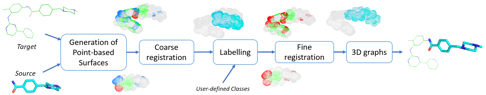
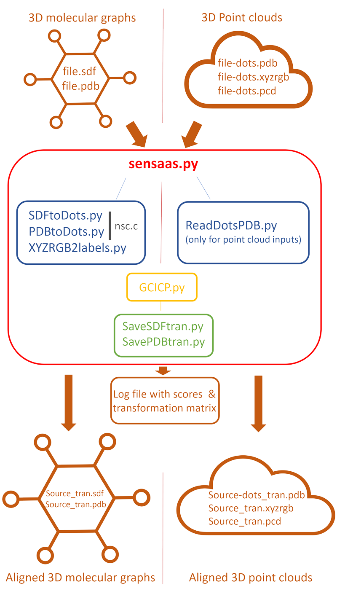

.. Documentation documentation master file, created by
   sphinx-quickstart on Tue May  4 09:28:38 2021.
   You can adapt this file completely to your liking, but it should at least
   contain the root `toctree` directive.

.. _my-reference-label:

Summary
================

* `What is SENSAAS?`_
* `How does SENSAAS work?`_
* `Installing`_
* `Program NSC`_
* `List of I/O Formats`_
* `Colors`_
* `Fitness scores`_
* `Tutorials`_
* `About This Project`_

What is SENSAAS?
================

.. image:: _static/alignment.png

**SENSAAS** is the result of a collaboration between researchers of two labs of `UCA (University Côte d'Azur) <https://univ-cotedazur.fr/>`_: `I3S <https://www.i3s.unice.fr>`_ and `IPMC <https://www.ipmc.cnrs.fr/cgi-bin/site.cgi>`_. 
Based on the publication `SenSaaS: Shape-based Alignment by Registration of Colored Point-based Surfaces <https://onlinelibrary.wiley.com/doi/full/10.1002/minf.202000081>`_, **SENSAAS** is a shape-based alignment software which allows to superimpose molecules in 3D space.

**Tutorial:** Several `videos <https://www.youtube.com/channel/UC3cjM1j8cQ-95ev0DNxRMOA>`_ on YouTube provide tutorials for installing and executing SENSAAS

1. Requirements and installation `https://www.youtube.com/watch?v=2mYZlW4QbvQ <https://www.youtube.com/watch?v=2mYZlW4QbvQ>`_
2. Using sensaas, a basic example `https://www.youtube.com/watch?v=IvLDvVvfMTA <https://www.youtube.com/watch?v=IvLDvVvfMTA>`_
3. Using meta-sensaas for virtual screening `https://www.youtube.com/watch?v=Z3qLQXEbW8o <https://www.youtube.com/watch?v=Z3qLQXEbW8o>`_
4. Using meta-sensaas for clustering `https://www.youtube.com/watch?v=X5caj1us6rY <https://www.youtube.com/watch?v=X5caj1us6rY>`_

Our algorithm runs with Python and requires the open-source library `Open3D <http://www.open3d.org/>`_.

How does SENSAAS work?
======================

3D point clouds or 3D meshes are data structures used in many fields well known by large audience (robotics, 3D reconstruction, games, autonomous navigation...) to model surfaces or volumes. Such 3D representations can also be relevant in chemistry to describe molecules although they were not the most used so far.

SENSAAS (SENsitive Surface As A Shape) is a shape-based alignment software using 3D point-based representation of the van der Waals surface1. SENSAAS is an original tool that combines recent methods dedicated to 3D registration, initially developed for the fusion of 3D point clouds, collected by devices such as depth cameras or LiDAR scanners.

Considering two molecules named Source and Target as inputs, SENSAAS gives a transformation matrix as output, leading to the "best" 3D alignment of Source on Target. SENSAAS follows four major steps:

- generation of a point cloud from the molecular surface of each input molecule; 
- coarse alignment of the two point clouds thanks to a geometry-aware global registration; 
- labelling of each point of the two clouds according to user-defined classes;
- refinement of this alignment by applying a color and geometry-aware local registration. At this step, a color is assigned to each point, in function of its label. 

**1. Generation of input point clouds** 
For each input file (Source and Target), a point cloud of the van der Waals surface is obtained. Each point is described by its 3D coordinates, and a color (RGB) according to the nature of the underlying atom.

**2. Coarse alignment by global registration** the Source point cloud is globally superimposed on the Target, by finding an initial matching in terms of
geometry only. The matching is done by using local 3D descriptors computed on a limited number of points (also called downsampled point clouds). We use the descriptors FPFH (presented in `Fast Point Feature Histograms (FPFH) for 3D Registration <https://ieeexplore.ieee.org/abstract/document/5152473>`_), and the matching is done with RANSAC (`Random Sample Consensus: A Paradigm for Model Fitting with Applications to Image Analysis and Automated Cartography <https://dl.acm.org/doi/10.1145/358669.358692>`_).

**3. Labelling of the points of each point cloud** Each point is colored according to its belonging to a user-defined class. In the current version, the classes depend on the pharmacophore features, but they could depend on any physico-chemical property mapped onto the surface, or any configuration given by the user.

**4. Refinement of the alignment** At this step, the registration takes into account the geometry of the point clouds, but also the color of the points assigned by labelling. The coarse alignment is improved by finding the best matching between the two colored point clouds. The method used here is the method of `Colored Point Cloud Registration Revisited <https://ieeexplore.ieee.org/document/8237287>`_.
This step results into a final transformation matrix (rotation + translation), that is applied to the Source molecule to get the final alignment. 

Installing
===========

SENSAAS relies on the open-source library Open3D. The current release of SENSAAS uses **Open3D version 0.12.0** along with **Python3.7**.

Visit the following URL for using Python packages distributed: 

* via PyPI: `http://www.open3d.org/docs/release/getting_started.html <http://www.open3d.org/docs/release/getting_started.html>`_ 
* or conda: `https://anaconda.org/open3d-admin/open3d/files <https://anaconda.org/open3d-admin/open3d/files>`_. For example, for windows-64, you can download *win-64/open3d-0.12.0-py37_0.tar.bz2*

Virtual environment for python with conda (for Windows for example)
-------------------------------------------------------------------

Install `conda or Miniconda <https://docs.conda.io/en/latest/miniconda.html>`_.

Launch Anaconda Prompt, then complete the installation::

   conda update conda
   conda create -n sensaas
   conda activate sensaas
   (sensaas) > conda install python=3.7 numpy

Once Open3D downloaded::

   (sensaas) > conda install open3d-0.12.0-py37_0.tar.bz2

(Optional) Additional packages for visualization with PyMOL::

   (sensaas) > conda install -c schrodinger -c conda-forge pymol-bundle

Retrieve and unzip SENSAAS repository in your desired folder. The directory containing executables is called sensaas-main. See below for running the program **sensaas.py** or **meta-sensaas.py**.

Linux
-----

Install (more information at http://www.open3d.org/docs/release/getting_started.html)::

   1. Python 3.7 and numpy
   2. Open3D version 0.12.0

(Optional) Install additional packages for visualization with PyMOL (more information at https://pymolwiki.org)::

   3. PyMOL

Retrieve and unzip SENSAAS repository in your desired folder. The directory containing executables is called sensaas-main. See below for running the program **sensaas.py** or **meta-sensaas.py**.

MacOS
-----

::

   Not tested

Program NSC
============

NSC is used to efficiently generate point clouds of molecules and to calculate their surfaces. It is written in C and was developed by Frank Eisenhaber who kindly licensed its use in SENSAAS. **Please be advised that the use of NSC is strictly tied to SENSAAS and its code is released under the following** `license <https://github.com/SENSAAS/sensaas/blob/main/License_NSC.txt>`_. If the NSC license is an issue for your application or if you wish to use NSC independently of SENSAAS, please contact the author Frank Eisenhaber (email: `frank.eisenhaber@gmail.com <frank.eisenhaber@gmail.com>`_) who will amicably manage your request.

References :

   1. F. Eisenhaber, P. Lijnzaad, P. Argos, M. Scharf, The Double Cubic Lattice Method: Efficient Approaches to Numerical Integration of Surface Area and Volume and to Dot Surface Contouring of Molecular Assemblies, Journal of Computational Chemistry, **1995**, 16, N3, pp.273-284.
   2. F. Eisenhaber, P. Argos, Improved Strategy in Analytic Surface Calculation for Molecular Systems: Handling of Singularities and Computational Efficiency, Journal of Computational Chemistry, **1993**,14, N11, pp.1272-1280.

**Executables nsc (for Linux) or ncs-win (for windows) are included in this repository**. In case they do not work on your system, you may have to compile it using the source file nsc-300.c in directory src/. Instructions for compilation:

1. **for Windows:**

The current executable nsc-win.exe was compiled by using http://www.codeblocks.org. Rename the executable as nsc-win.exe because 'nsc-win.exe' is used to set the variable nscexe in the Python script sensaas.py

2. **for Linux**::

	cc src/nsc-300.c -lm

rename a.out as nsc because 'nsc' is used to set the variable nscexe in the Python script sensaas.py::

	cp a.out nsc

List of I/O Formats
===================

In our implementation, input molecules are **3D structures with explicit hydrogen atoms**. Molecules are represented either by their 3D graphs or by their resulting 3D point clouds. 

**sensaas.py** reads several input file formats:

.. list-table::
   
 * - **Input type**
   - **File format**
   -
 * - sdf
   - SDF format file
   - 3D graph
 * - pdb
   - PDB format file
   - (3D graph) reads ATOM and HETATM coordinates
 * - dot
   - PDB format file
   - (Point cloud) reads HETATM lines that contain coordinates of dots and the atom type for defining the label
 * - xyzrgb
   - xyzrgb format file
   - (Point cloud) ascii file used in 3D data processing such as Open3D; contains coordinates of dots and color
 * - pcd
   - PCD format file
   - (Point cloud) used in 3D data processing such as Open3D

**The output file format depends on the input file format**:

- if the Source input file is **sdf** then **Source_tran.sdf** is the transformed sdf source file
- if the Source input file is **pdb** then **Source_tran.pdb** is the transformed pdb source file
- if the Source input file is **dot** then **Source-dots_tran.pdb** is the transformed dot file in pdb format
- if the Source input file is **xyzrgb** then **Source_tran.xyzrgb** is the transformed xyzrgb file
- if the Source input file is **pcd** then **Source_tran.pcd** is the transformed pcd file

Colors
=======

In our implementation, labels aim to recapitulate typical pharmacophore features such as aromatic (colored in green), lipophilic (colored in white/grey) and polar groups (colored in red):

- **class 1** (or label 1) includes non polar hydrogen (H) and halogen atoms excepting fluorines (Cl, Br and I). Hydrogen and halogen atoms are molecule endings. They are the most frequent atoms that contribute to the surface geometry and coloration, and thus, highlight the apolar surface area. Points belonging to this class are colored in white/grey.

- **class 2** (or label 2) includes polar atoms able to be involved in hydrogen bonds such as N, O, S, H (if linked to N or O) and F. Points belonging to this class are colored in red.

- **class 3** (or label 3) includes “skeleton elements” such as C, P and B. Points belonging to this class are colored in green.

- **class 4** (or label 4) includes  all elements not listed in the first three classes. This class is empty for most small organic molecules in medicinal chemistry. Points belonging to this class are colored in blue.

Fitness scores
==============

The alignments provided by SENSAAS are evaluated by fitness scores calculated from point clouds. A fitness score indicates how many points are paired. Points are considered paired if their distance is lower than a given threshold. In our implementation, we set the threshold value to 0.3 because it is the average distance between two adjacent points in our original point clouds.

Each score is similar to a Tversky coefficient tuned to evaluate the embedding of a point cloud in another one. Therefore, the score of the Source and the score of the Target may differ. The smallest point cloud of the two will always obtain the highest fitness score as more points are paired, proportionally.

There are three different fitness scores, but we only use 2 of them, gfit and hfit, to finally calculate gfit+hfit.

- **gfit** estimates the geometric matching of point-based surfaces. It is the ratio between the number of points of the transformed Source that match points of the Target, and its total number of points - **it ranges between 0 and 1**

- **hfit** estimates the matching of colored points representing pharmacophore features. It is the sum of the fitness for each class except the first class, to specifically evaluate the matching of polar and aromatic points (classes 2, 3 and 4) - **it ranges between 0 and 1**

- cfit is the sum of the fitness for each class, to specifically evaluate the matching of the colored points of the 4 classes - it ranges between 0 and 1

The hybrid score called **gfit+hfit** is the sum = gfit + hfit scores - **gfit+hfit ranges between 0 and 2**

  A gfit+hfit score close to 2.0 means a perfect superimposition.

  A gfit+hfit score > 1.0 means that similaries were identified.
    

Tutorials
===========

This tutorial presents several basic usages of SENSAAS with sdf molecular files.

Run sensaas.py
--------------

This script allows to align one Source molecule on one Target molecule::
	
   sensaas.py <target-type> <target-file-name> <source-type> <source-file-name> <log-file-name> <mode>

**<target-type>**
   type of the Target file (sdf/pdb/dot/xyzrgb/pcd)

**<target-file-name>**
   name of the Target file

**<source-type>**
   type of the Source file (sdf/pdb/dot/xyzrgb/pcd)

**<source-file-name>**
   name of the Source file

**<log-file-name>**
   name of the log file that details the alignment with **scores of Source**.

**<mode>**
   - **optim** executes the alignment and generates a transformation matrix
   
   - **eval** evaluates the superimposition "in place" (without aligning)

Example with the 'optim' mode
~~~~~~~~~~~~~~~~~~~~~~~~~~~

The following example works with two molecules from the directory examples/
::
	sensaas.py sdf examples/IMATINIB.sdf sdf examples/IMATINIB_mv.sdf slog.txt optim	
		
You may have to run the script as follows:
::
	python sensaas.py sdf examples/IMATINIB.sdf sdf examples/IMATINIB_mv.sdf slog.txt optim

.. note:: Don't worry if you get the following warning from Open3D: "*Open3D WARNING KDTreeFlann::SetRawData Failed due to no data.*". It is observed with conda on windows.

Here, the source file IMATINIB_mv.sdf is aligned (**moved**) on the target file IMATINIB.sdf (**that does not move**).

- The output file **Source_tran.sdf** contains the aligned (transformed) coordinates of the Source.

- The output file **tran.txt** contains the transformation matrix applied to the input Source file.

- The **slog.txt** file details results with final scores of the aligned Source molecule on the last line. In the current example, the last line must look like:

	gfit= 1.000 cfit= 0.999 hfit= 0.996 gfit+hfit= 1.996
	
with gfit and hfit close to the maximum value of 1.00. Indeed, IMATINIB_mv.sdf is the same 3D structure as IMATINIB.sdf but with a different orientation. In such case, SENSAAS perfectly aligns the two molecules.

**Visualization** To visualize the result, You can use any molecular viewer. For instance, you can use PyMOL if installed (see optional packages) to load the Target and the aligned Source::

	pymol examples/IMATINIB.sdf Source_tran.sdf 

Example with the 'eval' mode
~~~~~~~~~~~~~~~~~~~

Given two molecules, molecule1.sdf and molecule2.sdf, the eval mode evaluates the superimposition "in place" (without aligning)
::
		sensaas.py sdf molecule1.sdf sdf molecule2.sdf slog.txt eval	

Here, the resulting slog.txt contains final scores of molecule2.sdf on the last line.
::
		sensaas.py sdf molecule2.sdf sdf molecule1.sdf slog.txt eval
	
Here, the resulting slog.txt contains final scores of molecule1.sdf on the last line.

	
Run meta-sensaas.py
--------------------

This "meta" script only works with sdf files. It allows to align several source and target molecules. 

**1. Virtual Screening**

This script is suited for performing virtual screenings of sdf files containing several molecules (database mode). For example, if you want to process a sdf file containing several conformers for Target and/or Source. Solutions are ranked in descending order of score and a similarity matrix is provided. The syntax is::

	meta-sensaas.py molecules-target.sdf molecules-source.sdf
 
Example
~~~~~~~~

The following example works with 2 files from the directory examples/
::
	meta-sensaas.py examples/IMATINIB.sdf examples/IMATINIB_parts.sdf

You may have to run the script as follows:
::
	python meta-sensaas.py examples/IMATINIB.sdf examples/IMATINIB_parts.sdf

.. note:: Don't worry if you get the following warning from Open3D: "*Open3D WARNING KDTreeFlann::SetRawData Failed due to no data.*". It is observed with conda on windows.

Here, the source file IMATINIB_parts.sdf contains 3 substructures that are aligned (**moved**) on the target file IMATINIB.sdf (**that does not move**)

Outputs are:

- the file **bestsensaas.sdf** that contains the best ranked aligned Source
- the file **catsensaas.sdf** that contains all aligned Sources
- the file **matrix-sensaas.txt** that contains gfit+hfit scores (rows=Targets and columns=Sources)

**Visualization** You can use any molecular viewer. For instance, you can use PyMOL if installed (see optional packages)
::
	pymol examples/IMATINIB.sdf bestsensaas.sdf catsensaas.sdf

Post-processing 
~~~~~~~~~~~~~~~

To ease the analysis of the results, the script utils/ordered-catsensaas.py can be used to generate files in descending order of score.
::
	utils/ordered-catsensaas.py matrix-sensaas.txt catsensaas.sdf

You may have to run the script as follows:
::
	python utils/ordered-catsensaas.py matrix-sensaas.txt catsensaas.sdf
	
or if you want to only retrieve solutions having a gfit+hfit score above a defined cutoff
::

	python utils/ordered-catsensaas-cutoff.py matrix-sensaas.txt catsensaas.sdf 1.1

- the file **ordered-catsensaas.sdf** contains all aligned Sources in descending order of score
- the file **ordered-scores.txt** contains the original number of Source with gfit+hfit scores in descending order

**Visualization** You can use any molecular viewer. For instance, you can use PyMOL if installed (see optional packages)
::
	pymol examples/IMATINIB.sdf ordered-catsensaas.sdf

Option -s 
~~~~~~~~~

You can also select the score type by using the option -s

a) -s source
::
	meta-sensaas.py molecules-target.sdf molecules-source.sdf -s source

here the score of the aligned source will be used to rank solutions and to fill matrix-sensaas.txt. This is the default setting if the option -s is not indicated.

b) -s mean
::
	meta-sensaas.py molecules-target.sdf molecules-source.sdf -s mean
	
here the mean of the score of the target and of the aligned source will be used to rank solutions and to fill matrix-sensaas.txt. This option is interesting to favor source molecules that have the same size of the Target.

c) -s target
::
	meta-sensaas.py molecules-target.sdf molecules-source.sdf -s target

here the score of the target will be used to rank solutions and to fill matrix-sensaas.txt.
	
	

**2. Finding alternative alignments and Clustering**

This option allows to repeat in order to find alternative alignments when they exist as for example when aligning a fragment on a large molecule. It works with one Target and one Source only (or the first molecule of the sdf file). The syntax is::

	meta-sensaas.py target.sdf source.sdf -r 10

here 10 alignments of the Source will be generated and clustered.

Outputs are:
 
- the file **sensaas-1.sdf** with the best ranked alignment - it contains 2 molecules: first is Target and second the aligned Source
- the file **sensaas-2.sdf** (if exists) with the second best ranked alignment - it contains 2 molecules: first is Target and second the aligned Source
- ...
- file **cat-repeats.sdf** that contains all aligned Sources

Example
~~~~~~~~

The following example works with 2 files from the directory examples/
::
	meta-sensaas.py examples/VALSARTAN.sdf examples/tetrazole.sdf -r 100
	
You may have to run the script as follows:
::
	python meta-sensaas.py examples/VALSARTAN.sdf examples/tetrazole.sdf -r 100

.. note:: Don't worry if you get the following warning from Open3D: "*Open3D WARNING KDTreeFlann::SetRawData Failed due to no data.*". It is observed with conda on windows.

As described in the publication, outputs are:

- sensaas-1.sdf contains the self-matching superimposition
- sensaas-2.sdf contains the bioisosteric superimposition
- sensaas-3.sdf contains the geometric-only superimposition

To visualize the results, you can use any molecular viewer. For instance, you can use PyMOL if installed (see optional packages). State 1 is Target and State 2 is the aligned Source.
::
	pymol examples/VALSARTAN.sdf sensaas-1.sdf sensaas-2.sdf sensaas-3.sdf

.. image:: _static/valsartan-tetrazole.png

Miscellaneous Tools
--------------------

If you want that sensaas.py outputs Target and Source files in pcd and xyzrgb format, set the variable 'verbose' to 1 in the Python script sensaas.py. Then, you can visualize these point clouds using Open3D:

- Example to visualize a point cloud with Open3D
::

	utils/visualize.py examples/VALSARTAN.xyzrgb

or::

	utils/visualize.py examples/VALSARTAN.pcd

You can also convert a xyzrgb file into pdb file for visualization with PyMOL
::

	utils/xyzrgb2dotspdb.py examples/VALSARTAN.xyzrgb
	
It will generate the file 'dots.pdb'

	
More on SENSAAS algorithm for developpers
------------------------------------------

The Python script **sensaas.py** calls several other scripts to perform the alignment. The following Figure gives an overview of the code:

About This Project
==================

Licenses
--------

1. SENSAAS code is released under `the 3-Clause BSD License <https://opensource.org/licenses/BSD-3-Clause>`_
2. NSC code is released under the following `license <https://github.com/SENSAAS/sensaas/blob/main/License_NSC.txt>`_

Copyright
---------

Copyright (c) 2018-2021, CNRS, Inserm, Université Côte d'Azur, Dominique Douguet and Frédéric Payan, All rights reserved.

References
---------

`Douguet D. and Payan F., SenSaaS: Shape-based Alignment by Registration of Colored Point-based Surfaces, Molecular Informatics, 2020, 8 <https://onlinelibrary.wiley.com/doi/full/10.1002/minf.202000081>`_

https://doi.org/10.1002/minf.202000081

Bibtex format:

::

	@article{10.1002/minf.202000081,
	author 		= {Douguet, Dominique and Payan, Frédéric},
	title 		= {sensaas: Shape-based Alignment by Registration of Colored Point-based Surfaces},
	journal 	= {Molecular Informatics},
	volume 		= {39},
	number 		= {8},
	pages 		= {2000081},
	keywords 	= {Shape-based alignment, molecular surfaces, point clouds, registration, molecular similarity},
	doi 		= {https://doi.org/10.1002/minf.202000081},
	url 		= {https://onlinelibrary.wiley.com/doi/abs/10.1002/minf.202000081},
	eprint 		= {https://onlinelibrary.wiley.com/doi/pdf/10.1002/minf.202000081},
	year 		= {2020}
	}

and in case of software reuse:

::
  
	@software{sensaas,
	author 		= {Douguet, Dominique and Payan, Frédéric},
	title		= {{SENSAAS}},
	month		= June,
	year		= 2021,
	publisher	= {Github},
	howpublished	= {https://github.com/SENSAAS/sensaas}
	}

