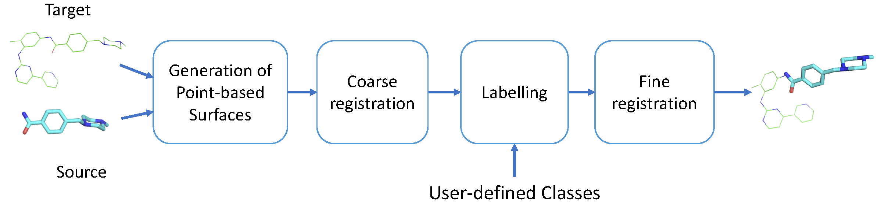

.. Documentation documentation master file, created by
   sphinx-quickstart on Tue May  4 09:28:38 2021.
   You can adapt this file completely to your liking, but it should at least
   contain the root `toctree` directive.

.. _my-reference-label:

What is SENSAAS?
================

.. image:: _static/alignement.png

**SENSAAS** is the result of a collaboration between researchers of two labs of `UCA (University Côte d'Azur) <https://univ-cotedazur.fr/>`_: `I3S <https://www.i3s.unice.fr>`_ and `IPMC <https://www.ipmc.cnrs.fr/cgi-bin/site.cgi>`_. 
Based on the publication `SenSaaS: Shape-based Alignment by Registration of Colored Point-based Surfaces <https://onlinelibrary.wiley.com/doi/full/10.1002/minf.202000081>`_, **SENSAAS** is a shape-based alignment program which allows to superimpose molecules in 3D space.

Our algorithm runs with Python and requires the open-source library `Open3D <http://www.open3d.org/>`_.

* `How does SENSAAS work?`_
* `Installing`_
* `Program NSC`_
* `List of I/O Formats`_
* `Colors`_
* `Fitness scores`_
* `Tutorials`_
* `About This Project`_

How does SENSAAS work?
======================

Considering two molecules named Source and Target as inputs, SENSAAS will propose a transformation matrix as output, that will lead to the "best" alignement of Source on Target. SENSAAS follows four major steps:

- generation of a point cloud of the molecular surface of the two input molecules; 
- coarse alignment of the two point clouds thanks to a geometry-aware registration; 
- labelling of each point of the two clouds according to user-defined classes;
- refinement of this alignement by applying a color and geometry-aware local registration. At this step, for each point, a color is associated with each class. 

**1. Generation of input point clouds** 
For each input file (Source and Target), a point cloud of the van der Waals surface is obtained. Each point is described by its 3D coordinates, and a color (RGB) according to the nature of the underlying atom.

**2. Coarse alignment by global registration** At this step, the Source point cloud is globally superimposed on the Target, by finding an initial matching in terms of
geometry only. The matching is done by using local 3D descriptors computed on a limited number of points (also called downsampled point clouds). Here, the descriptors named Fast Point Features Histograms (FPFH) presented in `Fast Point Feature Histograms (FPFH) for 3D Registration <https://ieeexplore.ieee.org/abstract/document/5152473>`_ are used, and their matching is done by using the RANSAC method: `Random Sample Consensus: A Paradigm for
Model Fitting with Applications to Image Analysis and Automated Cartography <https://dl.acm.org/doi/10.1145/358669.358692>`_.

**3. Labelling of the points of each point cloud** Each point is colored according to its belonging to a user-defined class. In the current version, the classes depend on the pharmacophore features, but they could depend on any physico-chemical property mapped onto the surface.

**4. Refinement of the first global alignement by applying a color and geometry-aware registration** At this step, the registration takes into account the geometry of the point clouds, but also the color of the points provided by the previous step of labelling. The coarse alignement is improved by finding the best matching between
the two colored point clouds. The method used here is the method presented in `Colored Point Cloud Registration Revisited <https://ieeexplore.ieee.org/document/8237287>`_.
This step results into a transformation matrix (rotation + translation), that is applied to the Source molecule to get the final alignement. 

Installing
===========

SENSAAS relies on the open-source library Open3D. The current release of SENSAAS uses **Open3D version 0.12.0** along with **Python3.7**.

Visit the following URL for using Python packages distributed: 

* via PyPI: `http://www.open3d.org/docs/release/getting_started.html <http://www.open3d.org/docs/release/getting_started.html>`_ 
* or conda: `https://anaconda.org/open3d-admin/open3d/files <https://anaconda.org/open3d-admin/open3d/files>`_. For example, for windows-64, you can download *win-64/open3d-0.12.0-py37_0.tar.bz2*

Virtual environment for python with conda (for Windows for example)
-------------------------------------------------------------------

Install `conda or Miniconda <https://docs.conda.io/en/latest/miniconda.html>`_.

Launch Anaconda Prompt, then complete the installation::

   conda update conda
   conda create -n sensaas
   conda activate sensaas
   (sensaas) > conda install python=3.7 numpy

After downloading the appropriate version of Open3D::

   (sensaas) > conda install open3d-0.12.0-py37_0.tar.bz2

(Optional) Additional packages for visualization with PyMOL::

   (sensaas) > conda install -c schrodinger -c conda-forge pymol-bundle

Retrieve and unzip SENSAAS repository in your desired folder. See below for running the program **sensaas.py** or **meta-sensaas.py**.

Linux
-----

Install (more information at http://www.open3d.org/docs/release/getting_started.html)::

   1. Python 3.7 and numpy
   2. Open3D version 0.12.0

(Optional) Install additional packages for visualization with PyMOL (more information at https://pymolwiki.org)::

   3. PyMOL

Retrieve and unzip SENSAAS repository in your desired folder. See below for running the program **sensaas.py** or **meta-sensaas.py**.

MacOS
-----

::

   Not tested

Program NSC
============

NSC is used to efficiently generate point clouds of molecules and to calculate their surfaces. It is written in C and was developed by Frank Eisenhaber who kindly licensed its use in SENSAAS. **Please be advised that the use of NSC is strictly tied to SENSAAS and its code is released under the following** `license <https://github.com/SENSAAS/sensaas/blob/main/License_NSC.txt>`_. If the NSC license is an issue for your application or if you wish to use NSC independently of SENSAAS, please contact the author Frank Eisenhaber (email: `frank.eisenhaber@gmail.com <frank.eisenhaber@gmail.com>`_) who will amicably manage your request.

References :

   1. F. Eisenhaber, P. Lijnzaad, P. Argos, M. Scharf, The Double Cubic Lattice Method: Efficient Approaches to Numerical Integration of Surface Area and Volume and to Dot Surface Contouring of Molecular Assemblies, Journal of Computational Chemistry, **1995**, 16, N3, pp.273-284.
   2. F. Eisenhaber, P. Argos, Improved Strategy in Analytic Surface Calculation for Molecular Systems: Handling of Singularities and Computational Efficiency, Journal of Computational Chemistry, **1993**,14, N11, pp.1272-1280.

Executables nsc (for Linux) or ncs-win (for windows) are included in this repository. In case they do not work on your system, you may have to compile it using the source file nsc.c in directory src/

**for Windows:**

The current executable nsc-win.exe was compiled by using http://www.codeblocks.org. Rename the executable as nsc-win.exe because 'nsc-win.exe' is used to set the variable nscexe in the Python script sensaas.py

**for Linux**::

   cc src/nsc.c -lm

rename a.out as nsc because 'nsc' is used to set the variable nscexe in the Python script sensaas.py::

   cp a.out nsc

List of I/O Formats
===================

In our implementation, input molecules are **3D structures with explicit hydrogen atoms**. Molecules are represented either by their 3D graphs or by their resulting 3D point clouds. SENSAAS reads several input file formats:

.. list-table::
   
 * - **Input type**
   - **File format**
   -
 * - sdf
   - SDF format file
   - 3D graph
 * - pdb
   - PDB format file
   - (3D graph) reads ATOM and HETATM coordinates
 * - dot
   - PDB format file
   - (Point cloud) reads HETATM lines that contain coordinates of dots and the atom type for defining the label
 * - xyzrgb
   - xyzrgb format file
   - (Point cloud) ascii file used in 3D data processing such as Open3D; contains coordinates of dots and color
 * - pcd
   - PCD format file
   - (Point cloud) used in 3D data processing such as Open3D

The output file format depends on the input file format:

- if the Source input file is **sdf** then **Source_tran.sdf** is the transformed sdf source file
- if the Source input file is **pdb** then **Source_tran.pdb** is the transformed pdb source file
- if the Source input file is **dot** then **Source-dots_tran.pdb** is the transformed dot file in pdb format
- if the Source input file is **xyzrgb** then **Source_tran.xyzrgb** is the transformed xyzrgb file
- if the Source input file is **pcd** then **Source_tran.pcd** is the transformed pcd file

Colors
=======

In our implementation, labels aim to recapitulate typical pharmacophore features such as aromatic (colored in green), lipophilic (colored in white/grey) and polar groups (colored in red):

- class 1 (or label 1) includes non polar hydrogen (H) and halogen atoms excepting fluorines (Cl, Br and I). Hydrogen and halogen atoms are molecule endings. They are the most frequent atoms that contribute to the surface geometry and coloration, and thus, highlight the apolar surface area. Points belonging to this class are colored in white/grey.

- class 2 (or label 2) includes polar atoms able to be involved in hydrogen bonds such as N, O, S, H (if linked to N or O) and F. Points belonging to this class are colored in red.

- class 3 (or label 3) includes “skeleton elements” such as C, P and B. Points belonging to this class are colored in green.

- class 4 (or label 4) includes  all elements not listed in the first three classes. This class is empty for most small organic molecules in medicinal chemistry. Points belonging to this class are colored in blue.

Fitness scores
==============

There are three different fitness scores but we only use 2 of them, gfit and hfit, to calculate gfit+hfit.

- **gfit** score estimates the geometric matching of point-based surfaces. It is the ratio between the number of points of the transformed Source that match points of the Target, and its total number of points - **it ranges between 0 and 1**

- **hfit** score estimates the matching of colored points representing pharmacophore features. It is the sum of the fitness for each class except the first class, to specifically evaluate the matching of polar and aromatic points (classes 2, 3 and 4) - **it ranges between 0 and 1**

- cfit score is the sum of the fitness for each class, to specifically evaluate the matching of the colored points of the 4 classes - it ranges between 0 and 1

The hybrid score is called **gfit+hfit** and is the sum = gfit + hfit scores
**gfit+hfit ranges between 0 and 2**

  A gfit+hfit score close to 2.0 means a perfect superimposition.

  A gfit+hfit score > 1.0 means that similaries were identified.
    

Tutorials
===========

**Tutorial:** `This video <nul>`_ on Youtube provides a tutorial for installing and executing SENSAAS

Run sensaas.py
--------------

To align a Source molecule on a Target molecule, the syntax is::
	
   python sensaas.py <target-type> <target-file-name> <source-type> <source-file-name> <log-file-name> <mode>

**<target-type>**
   type of the Target file (sdf/pdb/dot/xyzrgb/pcd)

**<target-file-name>**
   name of the Target file

**<source-type>**
   type of the Source file (sdf/pdb/dot/xyzrgb/pcd)

**<source-file-name>**
   name of the Source file

**<log-file-name>**
   name of the output file. It details the results of the alignement with final scores of Source on the last line.

**<mode>**
   - "optim": executes the alignment and generates a transformation matrix
   
   - "eval": evaluates the superimposition "in place" (without aligning)

Example
-------

The following example works with 2 molecules from the directory examples/::

	python sensaas.py sdf examples/IMATINIB.sdf sdf examples/IMATINIB_mv.sdf slog.txt optim	
		
Here, the source file IMATINIB_mv.sdf is aligned (**moved**) on the target file IMATINIB.sdf (**that does not move**).

The output file **Source_tran.sdf** contains the aligned (transformed) coordinates of the Source.

The output file **tran.txt** contains the transformation matrix applied to the Source file.

The **slog.txt** file details results with final scores of the aligned Source molecule on the last line. In the current example, the last line must look like:

	gfit= 1.000 cfit= 0.999 hfit= 0.996 gfit+hfit= 1.996
	
with gfit and hfit close to the maximum value of 1.00. Indeed, IMATINIB_mv.sdf is the same 3D structure as IMATINIB.sdf but with a different orientation. In such case, SENSAAS perfectly aligns the 2 molecules.

Visualization 
-------------

You can use any molecular viewer. For instance, you can use PyMOL if installed (see optional packages) to load the Target, the Source and the aligned Source(s)::

	pymol examples/IMATINIB.sdf examples/IMATINIB_mv.sdf Source_tran.sdf 
	
	
Example with sdf file
---------------------
::

   python sensaas.py sdf <target-file-name>.sdf sdf <source-file-name>.sdf slog.txt optim

Here the source file is aligned (moved) on the target file.

	the output tran.txt contains the transformation matrix allowing the alignment of the source file:

	    if Source input file is **sdf** then **Source_tran.sdf** is the transformed sdf source file

	    if Source input file is **pdb** then **Source_tran.pdb** is the transformed pdb source file

	    if Source input file is **dot** then **Source-dots_tran.pdb** is the transformed dot file in pdb format

 	    if Source input file is **xyzrgb** then **Source_tran.xyzrgb** is the transformed xyzrgb file

	    if Source input file is **pcd** then **Source_tran.pcd** is the transformed pcd file

**slog** (whatever you want to call it) details results with final scores on the last line.

.pcd or .xyzrgb file contains coordinates and rgb colors of points and can be read by Open3D (visualize.py in directory utils)

Example with IMATINIB.sdf
-------------------------

1. example (IMATINIB_mv.sdf was reoriented when compared with IMATINIB.sdf):

::

	(sensaas) > sensaas.py sdf DATASET/IMATINIB.sdf sdf DATASET/IMATINIB_mv.sdf slog.txt optim

Here, the source file IMATINIB_mv.sdf is aligned (**moved**) on the target file IMATINIB.sdf (**that does not move**). The output tran.txt contains the transformation matrix allowing the alignment of the source file (result in **Source_tran.sdf**). The slog.txt file details results with final scores on the last line. In this example, the last line must look like::

   gfit= 1.000 cfit= 0.999 hfit= 0.996 gfit+hfit= 1.996

Run meta-sensaas.py
--------------------

This "meta" script only works with sdf files 

Visualization
-------------

You can use any molecular viewer. For instance, you can use PyMOL if installed (see optional packages or help `to install PyMOL <https://pymol.org/2/support.html?#installation>`_)::

	pymol examples/IMATINIB.sdf examples/IMATINIB_mv.sdf Source_tran.sdf 
	
or after executing meta-sensaas.py with the repeat option::

	pymol examples/VALSARTAN.sdf sensaas-1.sdf sensaas-2.sdf sensaas-3.sdf

or after executing meta-sensaas.py with several molecules as Target and/or Source::
	
	pymol target.sdf bestsensaas.sdf catsensaas.sdf

More on SENSAAS algorithm for developpers
------------------------------------------

sensaas.py call different scripts to align molecules. Let show you how all the program works with a kind of blueprint:

.. image:: _static/schema.JPG
.. image:: _static/legend.jpg   

About This Project
==================

Licenses
--------

1. SENSAAS code is released under `the 3-Clause BSD License <https://opensource.org/licenses/BSD-3-Clause>`_
2. NSC code is released under the following `license <https://github.com/SENSAAS/sensaas/blob/main/License_NSC.txt>`_

Copyright
---------

Copyright (c) 2018-2021, CNRS, Inserm, Université Côte d'Azur, Dominique Douguet and Frédéric Payan, All rights reserved.

Reference
---------

`Douguet D. and Payan F., SenSaaS: Shape-based Alignment by Registration of Colored Point-based Surfaces, Molecular Informatics, 2020, 8 <https://onlinelibrary.wiley.com/doi/full/10.1002/minf.202000081>`_

https://doi.org/10.1002/minf.202000081
