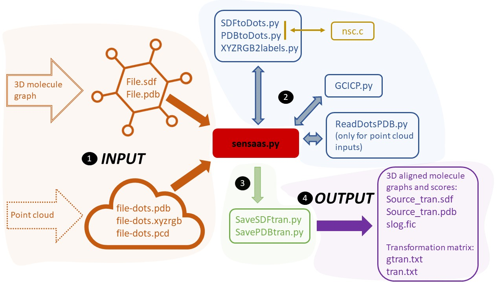
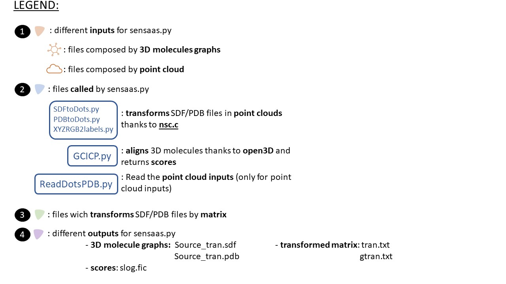

.. Documentation documentation master file, created by
   sphinx-quickstart on Tue May  4 09:28:38 2021.
   You can adapt this file completely to your liking, but it should at least
   contain the root `toctree` directive.

.. _my-reference-label:

Sensaas
====================================

**SENSAAS** is a shape-based alignment program which allows to superimpose molecules. It is based on the publication [SenSaaS: Shape-based Alignment by Registration of Colored Point-based Surfaces](https://onlinelibrary.wiley.com/doi/full/10.1002/minf.202000081)

.. image:: _static/alignement.png

This software is the result of a collaboration between researchers of two labs of `UCA (University Côte d'Azur) <https://univ-cotedazur.fr/>`_ : `I3S <https://www.i3s.unice.fr/>` and `IPMC <https://www.ipmc.cnrs.fr/cgi-bin/site.cgi>`_. 

SENSAAS is a shape-based alignment program which allows to superimpose molecules. It is based on the publication SenSaaS: `Shape-based Alignment by Registration of Colored Point-based Surfaces <https://onlinelibrary.wiley.com/doi/full/10.1002/minf.202000081>`_. Thanks to the `open3D library <http://www.open3d.org/>`_, molecules are represented in 3D to be align and visualize more easily. 
All the algorithm has been created with Python 3.7 and including a C library.

* `Requirements`_
* `Virtual environment for python with conda`_
* `Information on the third-party program NSC`_
* `Run Sensaas`_
* `Associated files of Sensaas`_
* `Visualization`_
* `Indices and tables`_

**Website:** A web demo is available `here <nul>`_

**Tutorial:** `This video <nul>`_ on Youtube provides a tutorial

Requirements
============
SENSAAS relies on the open-source library Open3D. The current release of SENSAAS uses **Open3D version 0.12.0** along with **Python3.7**.

Visit the following URL for using Python packages distributed: 

* via PyPI: `http://www.open3d.org/docs/release/getting_started.html <http://www.open3d.org/docs/release/getting_started.html>`_ 
* or conda: `https://anaconda.org/open3d-admin/open3d/files <https://anaconda.org/open3d-admin/open3d/files>`_. 

For example, for windows-64, you can download *win-64/open3d-0.12.0-py37_0.tar.bz2*

Virtual environment for python with conda
=========================================

Windows for example
-----------------------

Install `conda or Miniconda <https://docs.conda.io/en/latest/miniconda.html>`_.

Launch Anaconda Prompt, then complete the installation::

   conda update conda
   conda create -n sensaas
   conda activate sensaas
   conda install python=3.7 numpy

After downloading the appropriate version of Open3D::

   (sensaas) > conda install open3d-0.12.0-py37_0.tar.bz2

.. important::  **Please check that you have installed the appropriate versions** (open3D 0.12.0.0 for python 3.7 with Linux/Windows/MacOSX).

**(Optional)** Additional packages for using scripts in the directory utils/ or visualization with PyMOL::

   conda install perl
   conda install -c conda-forge rdkit
   conda install -c schrodinger -c conda-forge pymol-bundle

Retrieve and unzip SENSAAS repository in your desired folder. See below for running the program **sensaas.py**.

Linux
-----

Install:

   1. Python 3.7 and numpy
   2. Open3D version 0.12.0 (more information `here <http://www.open3d.org/docs/release/getting_started.html>`_)

**(Optional)** Install additional packages for using scripts in the directory utils/ or visualization with PyMOL:

   3. perl (usually it is already installed)
   4. RDKit (Open-Source Cheminformatics Software; more information at https://rdkit.org or https://github.com/rdkit/rdkit)
   5. PyMOL (a molecular viewer; more information at https://pymolwiki.org)

Retrieve and unzip SENSAAS repository

MacOS
-----

::

   Not tested

Information on the third-party program NSC
==========================================

NSC is used to efficiently generate point clouds of molecules and to calculate their surfaces. It is written in C and was developed by Frank Eisenhaber who kindly licensed its use in SENSAAS. **Please be advised that the use of NSC is strictly tied to SENSAAS and its code is released under the following** `license <https://github.com/SENSAAS/sensaas/blob/main/License_NSC.txt>`_. If the NSC license is an issue for your application or if you wish to use NSC independently of SENSAAS, please contact the author Frank Eisenhaber (email: `frank.eisenhaber@gmail.com <frank.eisenhaber@gmail.com>`_) who will amicably manage your request.

References :

   1. F. Eisenhaber, P. Lijnzaad, P. Argos, M. Scharf, The Double Cubic Lattice Method: Efficient Approaches to Numerical Integration of Surface Area and Volume and to Dot Surface Contouring of Molecular Assemblies, Journal of Computational Chemistry, **1995**, 16, N3, pp.273-284.
   2. F. Eisenhaber, P. Argos, Improved Strategy in Analytic Surface Calculation for Molecular Systems: Handling of Singularities and Computational Efficiency, Journal of Computational Chemistry, **1993**,14, N11, pp.1272-1280.

Executables nsc (for Linux) or ncs-win (for windows) are included in this repository. In case they do not work on your system, you may have to compile it using the source file nsc.c in directory src/

**for Windows:**

The current executable nsc-win.exe was compiled by using http://www.codeblocks.org. Rename the executable as nsc-win.exe because 'nsc-win.exe' is used to set the variable nscexe in the Python script sensaas.py

**for Linux**::

   cc src/nsc.c -lm

rename a.out as nsc because 'nsc' is used to set the variable nscexe in the Python script sensaas.py::

   cp a.out nsc

Run Sensaas
===========

This algorithm is used to optimize an alignment of 2 molecules or proteins. You can see results on `PyMol <https://pymol.org/2/>`_, if you don't own PyMol yet, click here: `Visualization`_.

.. warning:: Before using Sensaas, please check that your **inputs are 3D files**. The algorithm works only with **sdf/pdb/xyzrgb/pcd** 3D files. 

To align a Source molecule on a Target molecule, the syntax is:::
	
   python sensaas.py <target-type> <target-file-name> <source-type> <source-file-name> <output-file-name> <mode> (with the appropriate path)

**<target-type>**
   type of the target file (sdf/pdb/dot/xyzrgb/pcd)

**<target-file-name>**
   name of the target file (you need to precise the path of the target file)

**<source-type>**
   type of the source file (sdf/pdb/dot/xyzrgb/pcd)

**<source-file-name>**
   name of the source file (you need to precise the path of the source file)

**<output-file-name>**
   name of the output file that will be created. We usually named it "slog" but you can call it whatever you want. It details results of the alignement with final scores on the last line.

**<mode>** (optim or eval)
   \- "optim": generates a transformation matrix
   
   \- "eval": evaluate the alignment "in place" (without aligning)

When you will us SENSAAS, it will create **3 outputs files**: slog, Source_tran, tran.txt.

Example with sdf file
---------------------
::

   python sensaas.py sdf <target-file-name>.sdf sdf <source-file-name>.sdf slog.txt optim

Here the source file is aligned (moved) on the target file.

	the output tran.txt contains the transformation matrix allowing the alignment of the source file:

	    if Source input file is **sdf** then **Source_tran.sdf** is the transformed sdf source file

	    if Source input file is **pdb** then **Source_tran.pdb** is the transformed pdb source file

	    if Source input file is **dot** then **Source-dots_tran.pdb** is the transformed dot file in pdb format

 	    if Source input file is **xyzrgb** then **Source_tran.xyzrgb** is the transformed xyzrgb file

	    if Source input file is **pcd** then **Source_tran.pcd** is the transformed pcd file

**slog** (whatever you want to call it) details results with final scores on the last line.

.pcd or .xyzrgb file contains coordinates and rgb colors of points and can be read by Open3D (visualize.py in directory utils)

Example with IMATINIB.sdf
-------------------------

1. example (IMATINIB_mv.sdf was reoriented when compared with IMATINIB.sdf):

::

	(sensaas) > sensaas.py sdf DATASET/IMATINIB.sdf sdf DATASET/IMATINIB_mv.sdf slog.txt optim

Here, the source file IMATINIB_mv.sdf is aligned (**moved**) on the target file IMATINIB.sdf (**that does not move**). The output tran.txt contains the transformation matrix allowing the alignment of the source file (result in **Source_tran.sdf**). The slog.txt file details results with final scores on the last line. In this example, the last line must look like::

   gfit= 1.000 cfit= 0.999 hfit= 0.996 gfit+hfit= 1.996

There are three different fitness scores but we only use 2 of them, gfit and hfit, to calculate gfit+hfit.

   * gfit score estimates the geometric matching of point-based surfaces - it ranges between 0 and 1
   * hfit score estimates the matching of colored points representing pharmacophore features - it ranges between 0 and 1

Thus, we calculate a hybrid score = gfit + hfit scores - **gfit+hfit ranges between 0 and 2**

   * A gfit+hfit score close to 2.0 means a perfect superimposition.
   * A gfit+hfit score > 1.0 means that similaries were identified.

**(Option)** Here IMATINIB.sdf and IMATINIB_mv.sdf are the 2 same molecules thus, you can evaluate the RMSD value by using rdkit if installed (see optional packages above)::

   python utils/rdkit-CalcLigRMSD.py examples/IMATINIB.sdf Source_tran.sdf

Here, it returns RMSD= 0.00

2. example (IMATINIB_mv.sdf was reoriented when compared with IMATINIB.sdf)(with eval: To evaluate an alignment (in place)):

::

   (sensaas) > sensaas.py sdf DATASET/IMATINIB.sdf sdf DATASET/IMATINIB_mv.sdf slog eval

**slog** (whatever you want to call it) details results with final scores on the last line

Associated files of Sensaas
===========================

sensaas.py call different scripts to align molecules. Let show you how all the program works with a kind of blueprint:

Visualization
=============

You can use any molecular viewer. For instance, you can use PyMOL if installed (see optional packages)::

   pymol examples/IMATINIB.sdf examples/IMATINIB_mv.sdf Source_tran.sdf 

To install PyMol, `click here <https://pymol.org/2/>`_ -> click "Download" -> choose the right zip file

`To install PyMol <https://pymol.org/2/support.html?#installation>`_ with control terminal or on conda.

Indices and tables
==================

Licenses
--------

1. SENSAAS code is released under `the 3-Clause BSD License <https://opensource.org/licenses/BSD-3-Clause>`_
2. NSC code is released under the following `license <https://github.com/SENSAAS/sensaas/blob/main/License_NSC.txt>`_

Copyright
---------

Copyright (c) 2018-2021, CNRS, Inserm, Université Côte d'Azur, Dominique Douguet and Frédéric Payan, All rights reserved.

Reference
---------

`Douguet D. and Payan F., SenSaaS: Shape-based Alignment by Registration of Colored Point-based Surfaces, Molecular Informatics, 2020, 8 <https://onlinelibrary.wiley.com/doi/full/10.1002/minf.202000081>`_

https://doi.org/10.1002/minf.202000081
